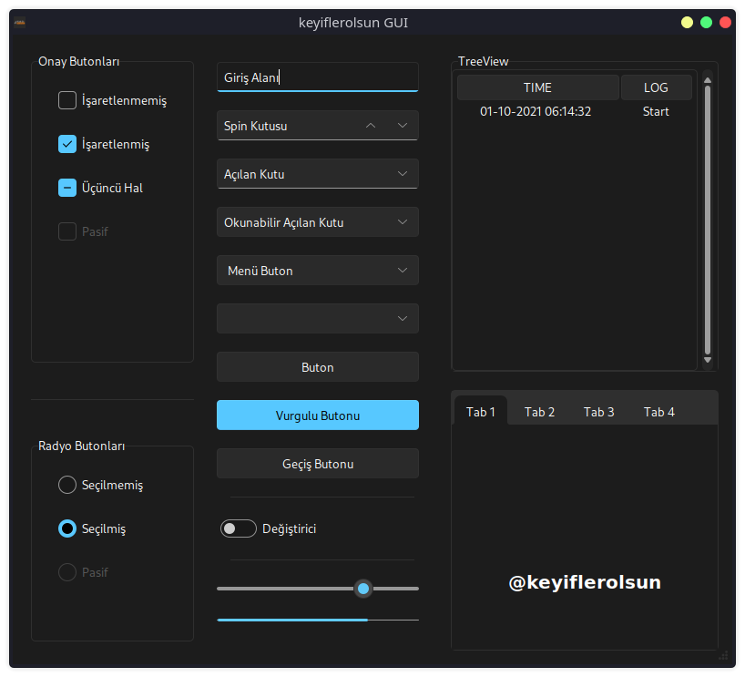
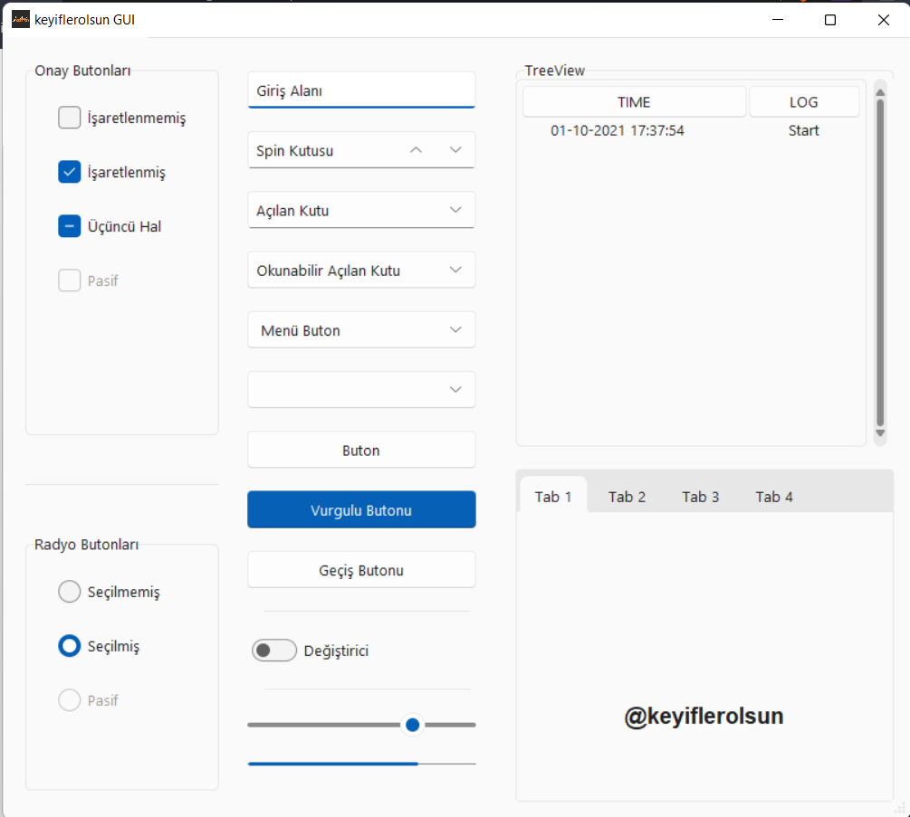

# 💻 keyifTk

**Tkinter Proje Taban Dosyaları**

[](https://www.python.org/)
[](https://GitHub.com/keyiflerolsun/)

## Ekran Görüntüleri





## 🚀 Derleme için Kopya Kağıdı

- [Nuitka Windows MSI Installer](https://nuitka.net/pages/download.html#id5)
- [MinGW64 Online Installer](https://sourceforge.net/projects/mingw-w64/files)
- [Creating a Stand Alone Executable (.exe) from a Python Script by Nuitka (Manual How To Windows)](https://www.youtube.com/watch?v=lCpvyfSwq5A)

```ps1
## Linux
python3 -m nuitka --assume-yes-for-downloads --onefile --follow-imports --include-data-dir=Temalar=Temalar --include-data-file=logo.png=logo.png --linux-onefile-icon=logo.png basla.py

## Windows
python -m nuitka --assume-yes-for-downloads --plugin-enable=tk-inter --windows-disable-console --onefile --follow-imports --include-data-dir=Temalar=Temalar --include-data-file=logo.png=logo.png --windows-icon-from-ico=logo.png basla.py


## etc
pyinstaller --noconfirm --onefile --windowed --icon "logo.png" --hidden-import "tkinter" --add-data "Temalar;Temalar"  "basla.py"

pyminifier --gzip --lzma --destdir=tmp/. *.py

```

## 🌐 Telif Hakkı ve Lisans

* *Copyright (C) 2021 by* [keyiflerolsun](https://github.com/keyiflerolsun) ❤️️
* [GNU GENERAL PUBLIC LICENSE Version 3, 29 June 2007](https://github.com/keyiflerolsun/keyifTk/blob/main/LICENSE) *Koşullarına göre lisanslanmıştır..*

## ♻️ İletişim

*Benimle iletişime geçmek isterseniz, **Telegram**'dan mesaj göndermekten çekinmeyin;* [@keyiflerolsun](https://t.me/keyiflerolsun)

## 💸 Bağış Yap

**[☕️ Kahve Ismarla](https://KekikAkademi.org/Kahve)**

##

> **[@KekikAkademi](https://t.me/KekikAkademi)** *için yazılmıştır..*
